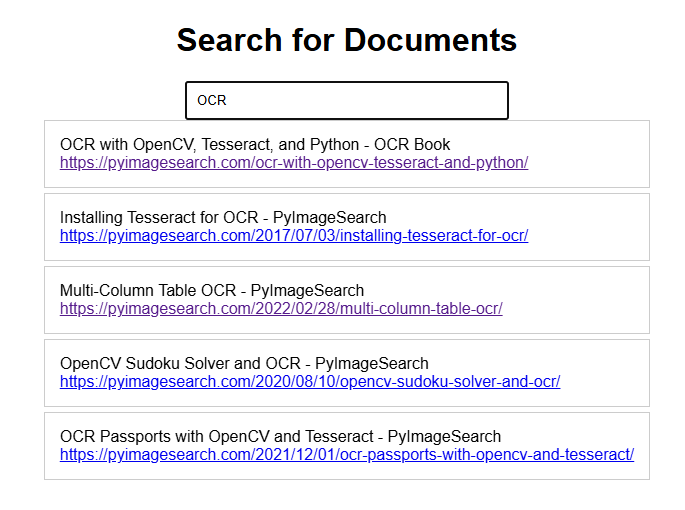

# Elasticsearch Search with Flask

This project is a simple web application that uses Flask and Elasticsearch to implement a search feature.



## Getting Started

These instructions will get you a copy of the project up and running on your local machine for development and testing purposes.

### Prerequisites

- Python
- Elasticsearch
- Flask

### Installing

1. Clone the repository
    ```bash
    git clone https://github.com/minhngoncoding/fuzzy-search.git
    ```
2. Install the required packages
    ```bash
    pip install -r requirements.txt
    ```
3. Run the application
    ```bash
    python app.py
    ```
   
4. Open your browser and go to `http://127.0.0.1:5000`